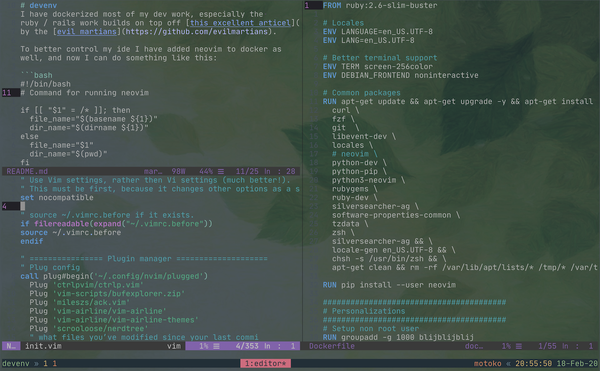

[](https://microbadger.com/images/blijblijblij/neovim "Get your own image badge on microbadger.com")
[](https://microbadger.com/images/blijblijblij/neovim "Get your own version badge on microbadger.com")

# devenv
I have dockerized most of my dev work, especially the 
ruby / rails work builds on top off [this excellent articel](https://evilmartians.com/chronicles/ruby-on-whales-docker-for-ruby-rails-development) 
by the [evil martians](https://github.com/evilmartians).

To better control my ide I have added neovim to docker as
well, and now I can do something like this:

```bash
#!/bin/bash
# Command for running neovim

if [[ "$1" = /* ]]; then
  file_name="$(basename ${1})"
  dir_name="$(dirname ${1})"
else
  file_name="$1"
  dir_name="$(pwd)"
fi

# Run the docker command
docker run -i -t -P -v "$dir_name":/src blijblijblij/neovim /bin/zsh -c "cd /src; nvim $file_name"
```

To get my ide going where-ever I want...



